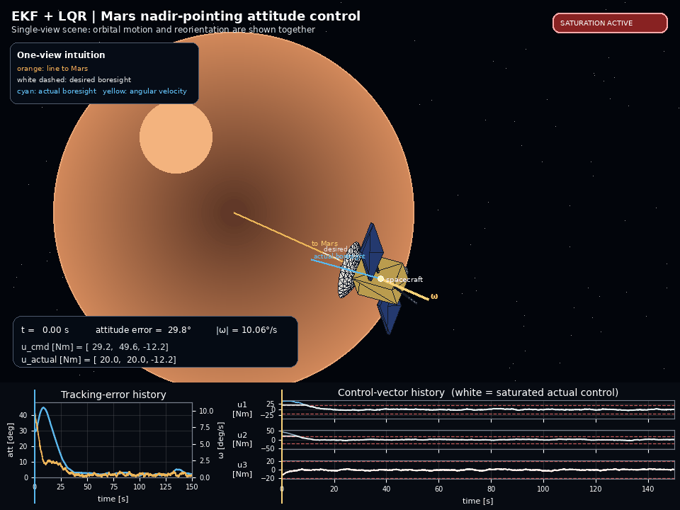
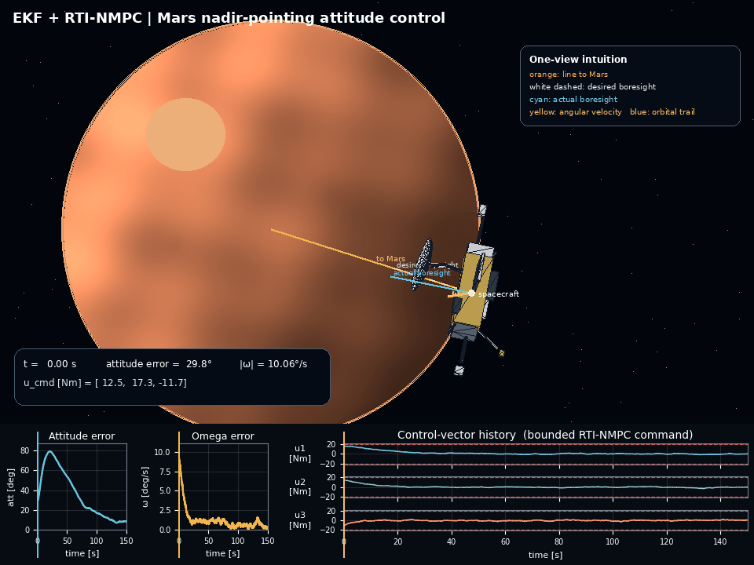

# Spacecraft Attitude Tracking under Gaussian Noise and Control Constraints

  
  

  Click either GIF to view the full-size animation. 
  These GIFs were generated using raw data from simulation, assisted by AI.

## Core Question
How do the tracking performances of LQR and Real-Time NMPC differ when a large tracking error occurs in a spacecraft attitude control environment characterized by sensor noise, disturbances, and control constraints?

## Goal
Spacecraft의 rotation을 담당하는 Reaction Wheel은 구조적인 안정성 때문에 적정 회전수와 토크에 제한이 있다. 우주에서 미션을 수행하는 spacecraft에 예상치 못한 자세오차가 발생했을 때 actuator 제약은 미션의 성공과 실패를 가르는 크리티컬한 요소가 될 수 있다. 시간 내에 그 오차를 해소하지 못한다면 미션이 실패할 수 있기 때문이다. 이 프로젝트는 sensor noise, gravity gradient, unexpected small disturbance가 존재하는 소규모 stochastic environment에서 control constraint가 있는 actuator를 가장 잘 control하며 tracking error를 해소하는 controller는 lqr과 real time nmpc 중 어느 것일지 판단한다. 

동일한 spacecraft와 sensing environment에서 LQR은 빠른 attitude correction을 위해
공격적인 torque를 사용하며 actuator saturation이 발생하였다.
RTI-NMPC는 동일한 torque bound를 직접 만족하면서 더 작은 control effort를 사용했지만,
attitude tracking error의 수렴은 상대적으로 느렸다.

# < Simulation Conditions >
[Normal Case: Small initial tracking error + trustworthy EKF]

Initial Attitude Tracking Error = around 7 degrees
Initial Angular Velocity Tracking Error = around 4 degrees

[Extreme Case: Large initial tracking error + uncertain EKF]

Initial Attitude Tracking Error = around 35 degrees
Initial Angular Velocity Tracking Error = around 30 degrees

# [ EKF + LQR ] vs [ EKF + Real-Time NMPC ]

# [ EKF + LQR ]: Normal Case vs Extreme Case
EKF + TVLQR 환경에서 normal case와 extreme case 그래프(tracking error, estimation error, commanded control, true gravity gradient) 추출

u abs max cmd

normal : [12.8076, 16.2495, 4.8823]

extreme : [38.3882, 49.6486, 12.2470]

# [ EKF + LQR ]: Actuator Torque Saturation
