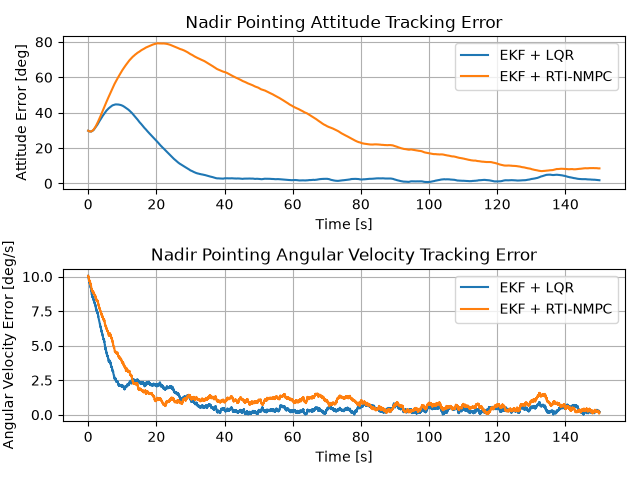
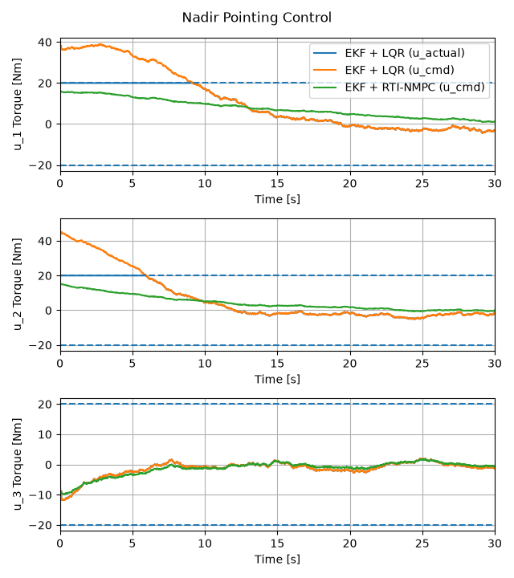
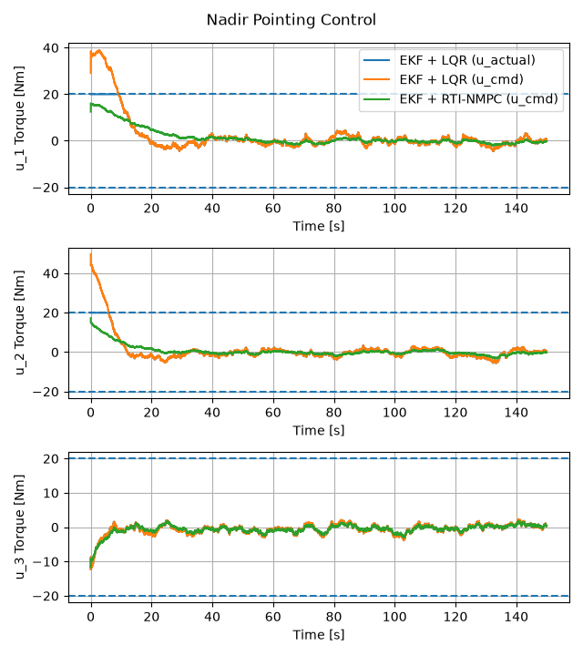
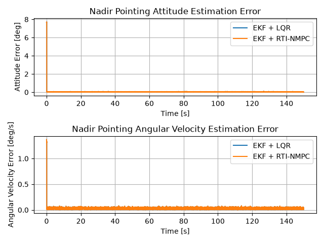
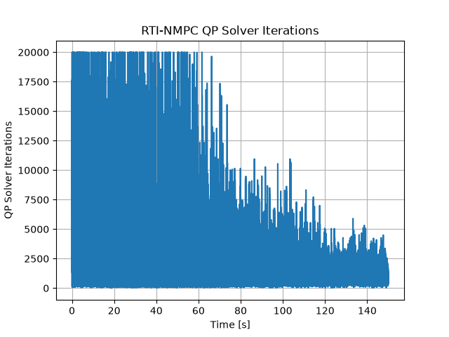
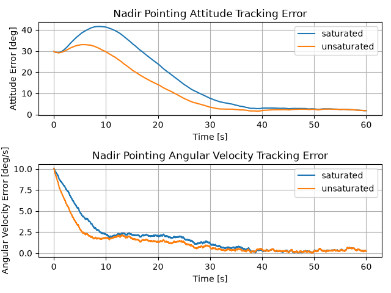
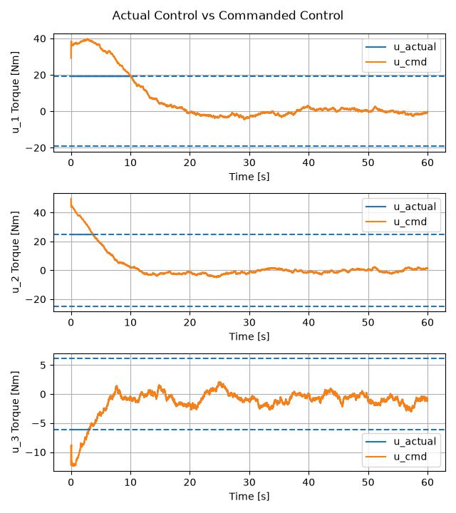
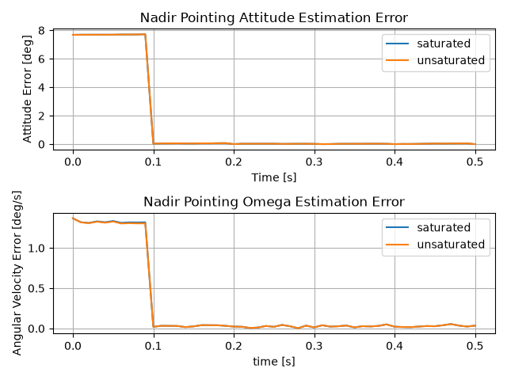
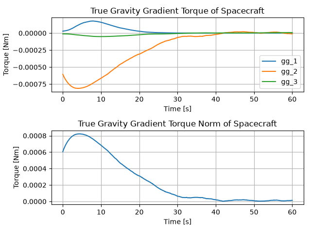

# Spacecraft Attitude Tracking under Stochastic Environment and Control Constraints

  
  

> **Summary:** Under the same control environment, LQR generated strong torque at the beginning to reduce the attitude error quickly, which led reaction wheel to saturation. In contrast, Real-Time NMPC satisfied the torque constraints and used relatively less control effort, but the attitude error converged more slowly.

## Overview
This Project analyzes the nadir-pointing attitude tracking performance of a spacecraft under sensor noise, gravity-gradient disturbance, and actuator torque constraints. The spacecraft attitude and angular velocity are esimated using an Extended Kalman Filter (EKF) based on measurements from a Star Tracker and a Gyroscope operating at different sampling rates.

Using the estimated state, the performances of LQR and RTI-NMPC are compared. LQR first computes the commanded control with no constraint, and then clip it according to the torque limit. In contrast, RTI-NMPC includes the torque constraints directly in its optimization problem and solves a Quadratic Program (QP) to obtain the optimal control.

## Settings
| Components | Models / Methods |
|---|---|
| Orbit | Mars Nadir-pointing Circular Orbit |
| State | MRP attitude error + body angular velocity error |
| Estimator | Extended Kalman Filter |
| Controllers | LQR / RTI-NMPC |
| Actuator | Reaction Wheel |
| Sensors | Star Tracker + Gyroscope |
| Disturbance | Gravity-gradient torque + Gaussian noise |
| Sensor Noise | Gaussian |

## Contents
[1. LQR vs RTI-NMPC](#experiment-1---lqr-vs-rti-nmpc)

[2. Actuator Saturation](#experiment-2---actuator-saturation)

[3. Normal case vs Extreme case](#experiment-3---normal-case-vs-extreme-case)

## Experiment 1 - LQR vs RTI-NMPC

### Question

### Setup

### Results

#### Tracking Error

  

#### Initial 30-second Control Input

  

#### Full Control Input

  

#### State Estimation Error

  

#### RTI-NMPC QP Solver Iterations

  

### Interpretation

## Experiment 2 - Actuator Saturation

### Question

### Setup

### Results

#### Tracking Error

  

#### Commanded vs Actual Control

  

#### State Estimation Error

  

#### Gravity-Gradient Disturbance

  

normal_case_u_max_abs : [12.8076, 16.2495, 4.8823]

extreme_case_u_max_abs : [38.3882, 49.6486, 12.2470]

### Interpretation

## Experiment 3 - Normal Case vs Extreme Case

### Question

### Setup

### Results

### Interpretation
