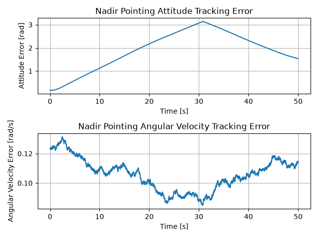
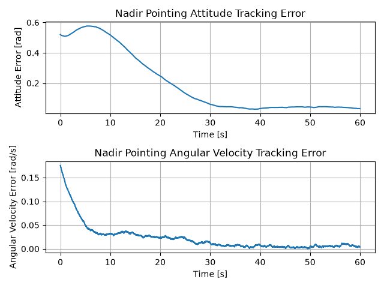
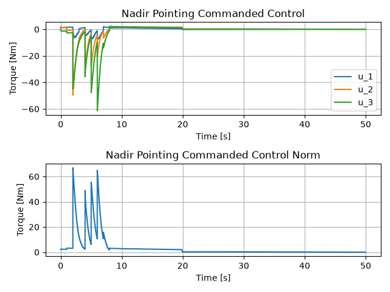
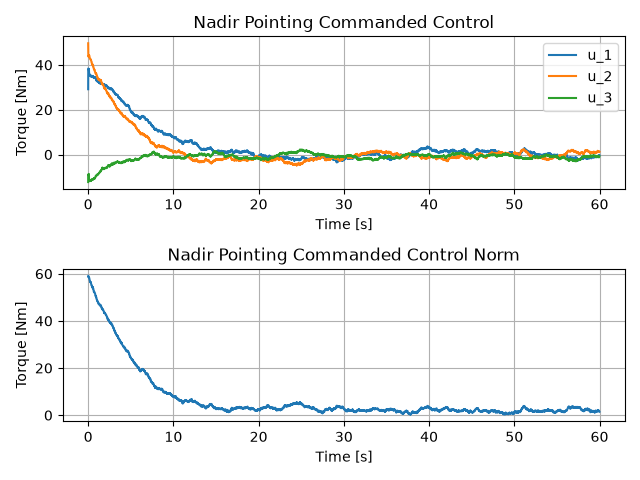
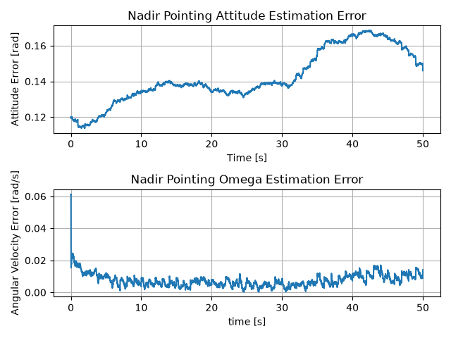
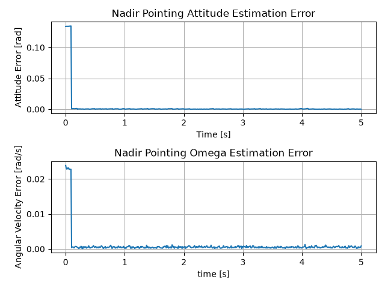
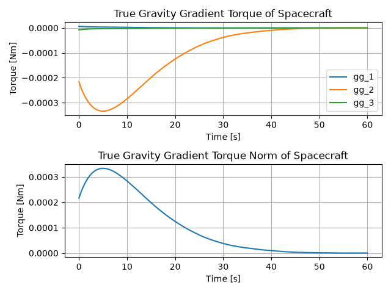
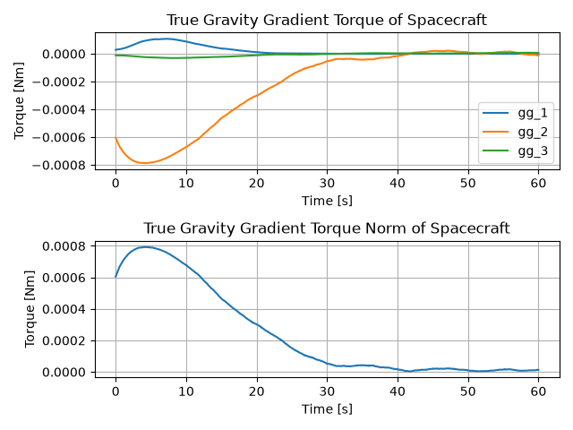

# Stochastic Spacecraft Attitude Tracking under Sensor Noise and Actuator Constraints

  
  

> **Summary:** Under the same control environment, LQR generated large commanded control at the beginning to reduce the attitude error quickly, which caused actuator saturation. In contrast, Real-Time NMPC satisfied the torque constraints and used less control effort, but the attitude error converged more slowly.

## Overview
This project analyzes the nadir-pointing attitude tracking performance of a spacecraft under sensor noise, gravity-gradient disturbance, and actuator torque constraints. The spacecraft attitude and angular velocity are estimated using an Extended Kalman Filter (EKF) based on measurements from a Star Tracker and a Gyroscope operating at different sampling rates.

Using the estimated state, the performance of LQR and RTI-NMPC is compared. LQR first computes the commanded control without considering the torque constraint, which is then clipped according to the torque limit. In contrast, RTI-NMPC includes the torque constraints directly in its optimization and solves a Quadratic Program (QP) to obtain the control input.

## Basic Settings
|  | Models / Methods |
|---|---|
| Orbit | Mars Nadir-pointing Circular Orbit |
| State | MRP attitude error + body angular velocity error |
| Estimator | Extended Kalman Filter |
| Controllers | LQR / RTI-NMPC |
| Actuator | Reaction Wheel |
| Sensors | Star Tracker + Gyroscope |
| Disturbance | Gravity-gradient torque + Gaussian noise |
| Sensor Noise | Gaussian |

## Contents
[1. Normal case vs Extreme case](#experiment-1---normal-case-vs-extreme-case)

[2. Actuator Saturation](#experiment-2---actuator-saturation)

[3. LQR vs RTI-NMPC](#experiment-3---lqr-vs-rti-nmpc)

## Experiment 1 - Normal Case vs Extreme Case

### Question

How does the same EKF-LQR compensator behave when the initial tracking error and the initial estimation uncertainty become much larger?

### Setup

Two initial conditions were compared using the same EKF-LQR simulation.

The Extreme case was created by increasing the initial tracking error, estimation uncertainty, and process noise.

|  | Normal Case | Extreme Case |
|---|---:|---:|
| Initial MRP | [0.03, -0.03, -0.01] | [0.09, -0.09, -0.03] |
| Initial Angular Velocity [deg/s] | [-2.5, -2, 1] | [-7.5, -6, 3] |
| Attitude Uncertainty [deg] | 3 | 9 |
| Angular Velocity Uncertainty [deg/s] | 1 | 3 |
| Simulation Time [s] | 60 | 60 |

### Results

#### Peak Absolute Commanded Control

|  | Axis 1 [Nm] | Axis 2 [Nm] | Axis 3 [Nm] |
|---|---:|---:|---:|
| Normal | 12.8076 | 16.2495 | 4.8823 |
| Extreme | 38.3882 | 49.6486 | 12.2470 |

#### 1) Tracking Error

<table>
  <tr>
    <th align="center">Normal Case</th>
    <th align="center">Extreme Case</th>
  </tr>
  <tr>
    <td align="center">
      
    </td>
    <td align="center">
      
    </td>
  </tr>
</table>

#### 2) Commanded Control

<table>
  <tr>
    <th align="center">Normal Case</th>
    <th align="center">Extreme Case</th>
  </tr>
  <tr>
    <td align="center">
      
    </td>
    <td align="center">
      
    </td>
  </tr>
</table>

<b>State Estimation Error</b>

 

#### 3) State Estimation Error

<table>
  <tr>
    <th align="center">Normal Case</th>
    <th align="center">Extreme Case</th>
  </tr>
  <tr>
    <td align="center">
      
    </td>
    <td align="center">
      
    </td>
  </tr>
</table>

<b>Gravity-Gradient Disturbance</b>

 

#### 4) Gravity-Gradient Disturbance

<table>
  <tr>
    <th align="center">Normal Case</th>
    <th align="center">Extreme Case</th>
  </tr>
  <tr>
    <td align="center">
      
    </td>
    <td align="center">
      
    </td>
  </tr>
</table>

### Interpretation

The tracking error was larger in the Extreme case as expected.

A larger difference was observed in the required control torque. The peak commanded torque increased from [12.81, 16.25, 4.88] [Nm] in the Normal case to [38.39, 49.65, 12.25] [Nm] in the Extreme case.

In the real world, since an actuator has a torque limit, the commanded control from the controller cannot be always applied 100%.

## Experiment 2 - Actuator Saturation

### Question

How much does actuator saturation affect the tracking performance when LQR requires a large control torque?

### Setup

The Extreme case defined in Experiment 3 was used for this test.

First, I ran the EKF-LQR simulation without an actuator limit and measured the maximum absolute commanded control of each axis. Then, the torque limit was set to half of each maximum value to intentionally produce actuator saturation.

| Axis | Torque Limit [Nm] |
|---|---:|
| 1 | 19.19 |
| 2 | 24.82 |
| 3 | 6.12 |

The saturated and unsaturated cases used the same initial state, sensor noise, process noise, and random seed.

### Results

#### 1) Commanded vs Actual Control

  

#### 2) Tracking Error

  

<b>State Estimation Error</b>

 

#### 3) State Estimation Error

  

<b>Gravity-Gradient Disturbance</b>

 

#### 4) Gravity-Gradient Disturbance

  

### Interpretation

The commanded control and actual control were different when the LQR command exceeded the actuator limit. The LQR itself returned the control calculated from the nonlinear dynamics, while the reaction-wheel clipped the torque before it was applied to the spacecraft.

Because less torque was available during the initial phase, the saturated case reduced the tracking error more slowly than the unsaturated case.

This was the main reason why I moved to constrained MPC. LQR is not aware of the actuator limit. Therefore, the actual applied control is different from the unconstrained commanded control calculated by LQR. I wanted the controller to consider the torque constraint while calculating the control itself.

## Experiment 3 - LQR vs RTI-NMPC

### Question

How do LQR and RTI-NMPC behave differently under the same control environment when the actuator has a fixed torque limit?

### Setup

The same dynamics, EKF, initial state, sensor models, process noise, and random seed were used for both controllers.

|  | Setting |
|---|---:|
| Simulation Time | 150 [s] |
| Simulation Step | 0.01 [s] |
| Star Tracker Sampling Rate | 10 [Hz] |
| Gyroscope Sampling Rate | 100 [Hz] |
| Torque Limit | -20 ~ 20 [Nm] |
| RTI-NMPC Prediction Horizon | 2 [s] |

| Cost Weights | LQR | RTI-NMPC |
|---|---:|---:|
| State Weight | `Q = diag(100, 100, 100, 500, 500, 500)` | `Q = diag(1, 1, 1, 5, 5, 5)` |
| Control Weight | `R = 0.01 * eye(3)` | `R = 0.0001 * eye(3)` |
| Terminal Weight | `Qf = diag(200, 200, 200, 1000, 1000, 1000)` | `P = diag(200, 200, 200, 1000, 1000, 1000)` |

For RTI-NMPC, the stage weights Q and R were multiplied by the simulation step `dt = 0.01` to match the scaling of the continuous cost used by LQR, while the terminal state weight P was set equal to the LQR terminal state weight Qf.

### Results

#### Scalar Metrics

|  | EKF + LQR | EKF + RTI-NMPC |
|---|---:|---:|
| Attitude Tracking RMSE [deg] | 14.3449 | 42.9950 |
| Angular Velocity Tracking RMSE [deg/s] | 1.7224 | 2.0530 |
| Final Attitude Error [deg] | 1.8173 | 8.5154 |
| Final Angular Velocity Error [deg/s] | 0.1850 | 0.1896 |
| Control Effort [Nm^2 s] | 8699.2887 | 3996.7246 |
| Control Limit Violation [%] | 3.3667 | 0.0000 |

#### 1) Tracking Error

  

The attitude tracking RMSE was 14.3449 [deg] for EKF + LQR and 42.9950 [deg] for EKF + RTI-NMPC. At the end of the 150 s simulation, the attitude tracking errors were 1.8173 [deg] and 8.5154 deg, respectively.

#### 2) Initial 30-second Control Input

  

The LQR's commanded control exceeded the 20 [Nm] torque limit during the initial steps, while the RTI-NMPC's commanded control remained within the torque limit. The control limit violation rates over the full simulation were 3.3667% and 0%, respectively.

#### 3) Full Control Input

  

The total control effort was 8699.2887 [Nm^2s] for LQR and 3996.7246 [Nm^2s] for RTI-NMPC. Therefore, RTI-NMPC used 45.94% of the LQR control effort in this simulation.

<b>RTI-NMPC QP Solver Iterations</b>

 

#### 4) RTI-NMPC QP Solver Iterations

  

Among 15,000 total QP solves, 14,863 solves were `optimal`, 136 solves were `optimal_inaccurate`, and one solve failed. The mean of the OSQP iterations was 3111.7.

<b>State Estimation Error</b>

 

#### 5) State Estimation Error

  

### Interpretation

The most noticeable difference was the initial control behavior. LQR tried to reduce the attitude tracking error quickly and generated large commanded control. Since the LQR was not aware of the actuator torque limit, part of the commanded control was clipped by the reaction-wheel torque saturation.

RTI-NMPC behaved more conservatively. Its control input stayed inside the torque constraint and the total control effort was much smaller than that of LQR. However, the attitude tracking error decreased more slowly.

In this simulation, the angular velocity weights were given larger than the attitude weights. I think this tuning and the actuator constraint made RTI-NMPC avoid using large torque only to reduce the attitude tracking error quickly.

Therefore, I could not interpret this result as RTI-NMPC having better tracking performance than LQR. LQR showed much faster attitude tracking in this case. The critical advantage I observed from RTI-NMPC was that the actuator constraint was considered before the control was applied instead of clipping an already calculated commanded control, which made RTI-NMPC did not violate the actuator constraint during the simulation.

The QP result also showed a computational limitation. Most QPs were solved successfully, but the mean OSQP iteration count was relatively large and one QP failed during the simulation. The current implementation is therefore useful for comparing the control methods, but I would not consider it a real-time spacecraft implementation yet.
